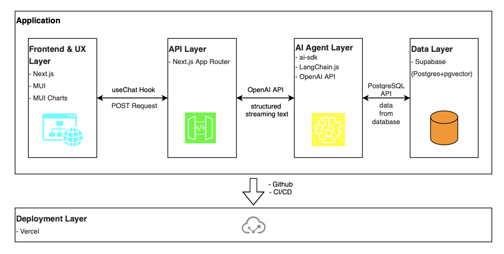
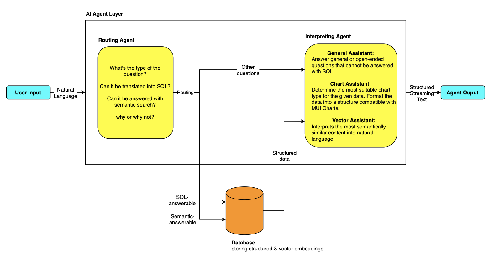

# nextjs-ai-chat

A **Conversational AI Assistant for Visualising Business Data Analytics** built with **Next.js**, **Material UI**, **Supabase(PostgresSQL+pgvector)**, **ai-sdk**, **LangChain.js** and **OpenAI API**.  

It lets non-technical users explore and visualise business data via **natural language queries**, using custom LLM agents for **SQL generation**, **real-time data visulisation**, and **vector-based semantic search** with AI-generated insights, integrating **RAG (Retrieval-Augmented Generation)**.

[Live Demo (Vercel Project)](https://nextjs-ai-chat-mu-ten.vercel.app)

---

## Table of Contents

- [Features](#features)  
- [Tech Stack](#tech-stack)  
- [Architecture Overview](#architecture-overview)  
- [Demo](#demo)  
- [Getting Started](#getting-started)  
- [Example Usage](#example-usage)  
- [Roadmap](#roadmap)  
- [Security Notes](#security-notes)  
- [License](#license)

---

## Features

- **Natural Language → SQL**: Routing: converts user questions into SQL queries.
- **Natural Language → Vector-based Semantic Search**: Routing: transforms user questions into embeddings to retrieve semantically similar results.
- **Natural Language → General Content**: Routing: directs user questions to the Agent for a general response.
- **RAG-Enhanced Answers**: Retrieves relevant context to improve accuracy and grounding from database.  
- **Interactive Visualisations**: Renders charts from query structured results in real time, supporting line, bar, and pie chart.  
- **AI Insights**: Summarises findings next to the visuals for quick interpretation.  
- **Production-Friendly Stack**: Next.js app routes, MUI components, ai-sdk orchestration, Supabase (PostgreSQL+pgvector).  
- **Real Dataset**: Built and tested on a TikTok sales dataset to reflect real business scenarios.

---

## Tech Stack

| Layer      | Technology |
|-----------|------------|
| Frontend  | React.js, Next.js, Material UI |
| AI/LLM    | ai-sdk, LangChain.js, OpenAI API |
| Backend   | Next.js API Routes, Node.js v22.8.0 |
| Database  | Supabase (PostgreSQL+pgvector) |
| Deploy    | Vercel |

---

## Architecture Overview





---

## Demo

**Live Demo:** [Open Vercel project](https://nextjs-ai-chat-mu-ten.vercel.app)  
**Animated Preview:**


**Snapshot Preview:**

  
  
  
  
  
  

---

## Getting Started

### 1) Clone the repository

```bash
git clone https://github.com/karlinglee93/nextjs-ai-chat.git
cd nextjs-ai-chat
```

### 2) Install dependencies

```bash
npm install
```

### 3) Configure environment variables

Create a `.env.local` file in the project root:

```env
# Generative AI
OPENAI_API_KEY=your_openai_api_key

# Supabase / PostgreSQL
POSTGRES_URL="your_postgres_url"
POSTGRES_USER="your_postgres_user"
POSTGRES_HOST="your_postgres_host"
SUPABASE_JWT_SECRET="your_supabase_jwt_secret"
POSTGRES_PRISMA_URL="your_postgres_prisma_url"
POSTGRES_PASSWORD="your_postgres_password"
POSTGRES_DATABASE="your_postgres_database"
SUPABASE_URL="your_supabase_url"
NEXT_PUBLIC_SUPABASE_URL="your_supabase_url"
NEXT_PUBLIC_SUPABASE_ANON_KEY="your_supabase_anon_key"
SUPABASE_SERVICE_ROLE_KEY="your_supabase_service_role_key"
POSTGRES_URL_NON_POOLING="your_postgres_url_non_pooling"
```

> ⚠ **Security Tip:** Never commit real keys or database credentials to GitHub.

### 4) Run the development server

```bash
npm run dev
```

Open your browser at `http://localhost:3000`.

---

## Example Usage

1. Enter a query, for example:
   ```
   Show me the top 10 products by sales in Q2
   ```
2. The system will:
   - Convert the query into an SQL statement  
   - Fetch relevant data from Supabase  
   - Render an interactive chart  
   - Provide an AI-generated summary of insights

---

## Roadmap

- [ ] Implement authentication and user-specific dashboards  
- [ ] Enable support for multiple datasets  
- [ ] Add export options for visualisations (PNG/PDF)  
- [ ] Implement drill-down analytics and advanced filters  

---

## Security Notes

- Store API keys and database credentials securely in `.env.local`  
- Use least-privilege database roles in production  
- Enable Row-Level Security (RLS) in Supabase for restricted access  

---

## License

This project is licensed under the **MIT License** – see the [LICENSE](LICENSE) file for details.
